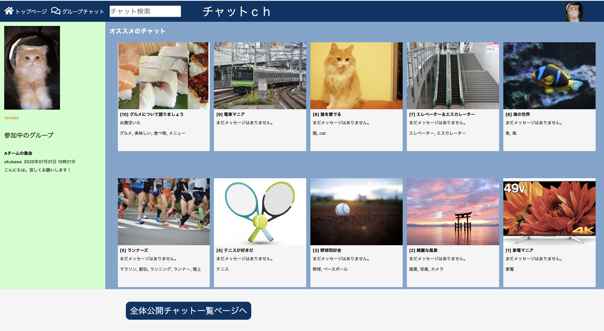
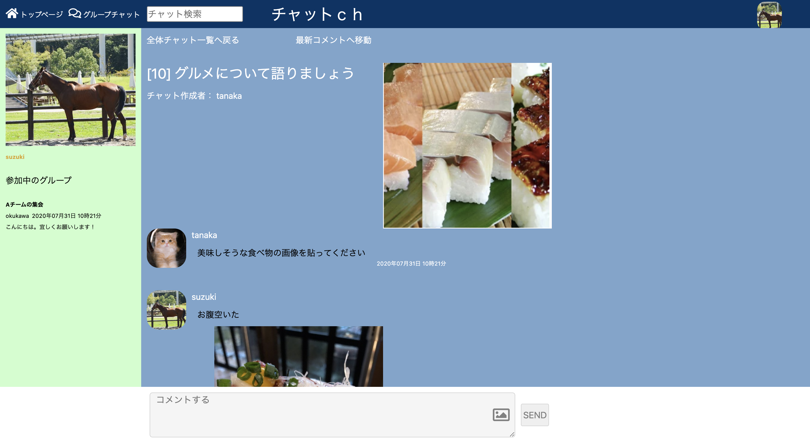
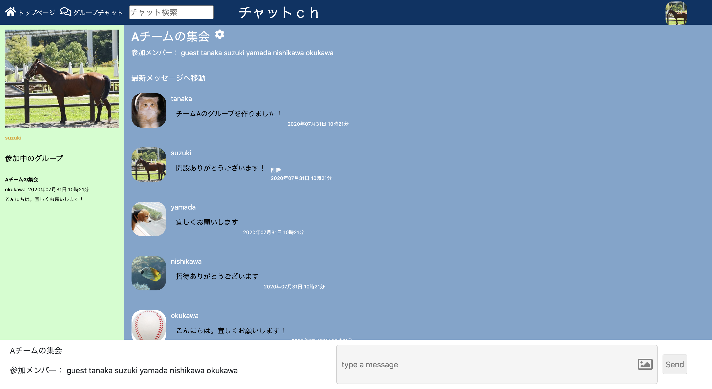

# README

## アプリ名
チャットch

## 概要
### 初個人開発のチャットアプリ
主な機能：  
* ユーザー登録/編集　（アバター画像追加可能）  
* チャットグループの作成/編集/削除 
* 全体公開チャットの作成/編集/削除/タグ付け　（各チャット毎のメイン画像追加可能）  
* 各チャットグループへのコメント投稿/削除　（非同期通信対応）  
* 全体公開チャットの検索

## 本番環境
- デプロイ先：　URL　http://54.150.76.116/ 
- テストアカウント：  
ユーザー名　guest 
e-mail　guest@mail.com 
Pass　guest000

## 制作背景
営業職からITエンジニアに転職することを目指して、プログラミング学習を始めて最初に作ったアプリです。 
駆け出しエンジニアを目指している今、私に必要なのは学習、実践、コミュニティー拡大。 
知識や経験が少ないため、人との繋がりが大切と考えました。 
今やTwitterやFaceBook、Lineなどコミュニティーを広げるためのアプリを日常的に利用していますが、 
利用しているアプリの機能はどのように実装されているのかという視点で、学習したことの応用として実装しました。

## DEMO

## 工夫したポイント
全体公開チャットは2ch等の掲示板を意識していますが、キーワードやタイトルだけで記事の魅力を伝えるよりも、 
記事に関連する特徴的な画像をピックアップ画面としてトップページに表示することで、利用者に魅力が伝わりやすく、見た目も華やかになると思い実装しました。 
同様の観点からユーザーのアバター画像も付けました。

## 使用技術（開発環境）
Ruby/Ruby on Rails/JavaScript/jQuery/MySQL/Github/AWS/Visual Studio Code  
* Ruby 2.6.5  
* gem 'acts-as-taggable-on'

## 今後実装したい機能
* 検索機能の拡張 
* 動画の投稿 
* 見た目を格好良くJavaScriptで装飾する 
* リファクタリング（DRY原則）

## DB設計

### user_groupsテーブル

|Column|Type|Options|
|------|----|-------|
|user_id|integer|null: false, foreign_key: true|
|group_id|integer|null: false, foreign_key: true|

#### Association
- belongs_to :group
- belongs_to :user

### usersテーブル

|Column|Type|Options|
|------|----|-------|
|email|integer|null: false|
|password|integer|null: false|
|name|string|null: false|
|password confirmation|integer|null: false|
|image|text|

#### Association
- has_many :group_users
- has_many :tag_users
- has_many :groups, through: :group_users
- has_many :tags, through: :tag_users
- has_many :messages

### groupsテーブル

|Column|Type|Options|
|------|----|-------|
|name|string|null: false|

#### Association
- has_many :group_users
- has_many :tag-groups
- has_many :users, through: :group_users
- has_many :tags, through: :tag-groups
- has_many :messages

### messagesテーブル

|Column|Type|Options|
|------|----|-------|
|text|text||
|image|text||
|user_id|integer|null: false, foreign_key: true|
|group_id|integer|null: false, foreign_key: true|

#### Association
- belongs_to :group
- belongs_to :user

### all_users_chatsテーブル

|Column|Type|Options|
|------|----|-------|
|name|string||
|image|string||
|user_id|integer|null: false, foreign_key: true|

#### Association
- has_many :comments
- belongs_to :user

### commentsテーブル

|Column|Type|Options|
|------|----|-------|
|content|string||
|image|string||
|user_id|integer|null: false, foreign_key: true|
|all_users_chat_id|integer|null: false, foreign_key: true|

#### Association
- belongs_to :all_users_chat
- belongs_to :user

### tag_usersテーブル

|Column|Type|Options|
|------|----|-------|
|user_id|integer|null: false, foreign_key: true|
|tag_id|integer|null: false, foreign_key: true|

#### Association
- belongs_to :tag
- belongs_to :user

### taggingsテーブル
|Column|Type|Options|
|------|----|-------|
|tag_id|integer|null: false, foreign_key: true|
|taggable_id|integer|null: false, foreign_key: true|

#### Association
- belongs_to :tag
- belongs_to :all_users_chat

### tagsテーブル
|Column|Type|Options|
|------|----|-------|
|name|string|null: false|

#### Association
- has_many :taggings
- has_many :all_users_chats, through: :taggings
